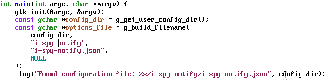

# ts-movement-mode

This Emacs mode lets you traverse the Tree Sitter syntax tree.



This package uses the built-in `treesit` package available starting from Emacs 29.

This package supports [multiple-cursors](https://github.com/magnars/multiple-cursors.el).

## Installation

This package is not on any ELPA yet. You must use this repository as a package. You can use the following steps.

1. Create a directory `~/.emacs.d/site-lisp` if it does not already exist.
2. Clone the repository in this directory.

### Recommended configuration

```lisp
(use-package ts-movement
  :load-path "site-lisp/ts-movement"
  :ensure multiple-cursors
  :ensure hydra
  :config
  (defhydra tsm/hydra ()
    "TS Movement"
    ("d" #'tsm/delete-overlay-at-point)
    ("D" #'tsm/clear-overlays-of-type)
    ("C-b" #'tsm/backward-overlay)
    ("C-f" #'tsm/forward-overlay)
    ("b" #'tsm/node-prev)
    ("f" #'tsm/node-next)
    ("p" #'tsm/node-parent)
    ("n" #'tsm/node-child)
    ("N" #'tsm/node-children)
    ("s" #'tsm/node-children-of-type)
    ("a" #'tsm/node-start)
    ("e" #'tsm/node-end)
    ("m" #'tsm/node-mark)
    ("c" #'tsm/mc/mark-all-overlays))
  (define-key ts-movement-map (kbd "C-c .") #'tsm/hydra/body)
  (push 'tsm/hydra/tsm/mc/mark-all-overlays mc--default-cmds-to-run-once)
  :hook
  (bash-ts-mode . ts-movement-mode)
  (c++-ts-mode . ts-movement-mode)
  (c-ts-mode . ts-movement-mode)
  (cmake-ts-mode . ts-movement-mode)
  (csharp-ts-mode . ts-movement-mode)
  (css-ts-mode . ts-movement-mode)
  (dockerfile-ts-mode . ts-movement-mode)
  (go-mod-ts-mode . ts-movement-mode)
  (go-ts-mode . ts-movement-mode)
  (java-ts-mode . ts-movement-mode)
  (js-ts-mode . ts-movement-mode)
  (json-ts-mode . ts-movement-mode)
  (python-ts-mode . ts-movement-mode)
  (ruby-ts-mode . ts-movement-mode)
  (rust-ts-mode . ts-movement-mode)
  (toml-ts-mode . ts-movement-mode)
  (tsx-ts-mode . ts-movement-mode)
  (typescript-ts-mode . ts-movement-mode)
  (yaml-ts-mode . ts-movement-mode))
```

### Minimal configuration

```lisp
(use-package ts-movement
  :load-path "site-lisp/ts-movement"
  :init
  (define-key ts-movement-map (kbd "C-c . d") #'tsm/delete-overlay-at-point)
  (define-key ts-movement-map (kbd "C-c . D") #'tsm/clear-overlays-of-type)
  (define-key ts-movement-map (kbd "C-c . b") #'tsm/node-prev)
  (define-key ts-movement-map (kbd "C-c . C-b") #'tsm/backward-overlay)
  (define-key ts-movement-map (kbd "C-c . C-f") #'tsm/forward-overlay)
  (define-key ts-movement-map (kbd "C-c . f") #'tsm/node-next)
  (define-key ts-movement-map (kbd "C-c . p") #'tsm/node-parent)
  (define-key ts-movement-map (kbd "C-c . n") #'tsm/node-child)
  (define-key ts-movement-map (kbd "C-c . N") #'tsm/node-children)
  (define-key ts-movement-map (kbd "C-c . s") #'tsm/node-children-of-type)
  (define-key ts-movement-map (kbd "C-c . a") #'tsm/node-start)
  (define-key ts-movement-map (kbd "C-c . e") #'tsm/node-end)
  (define-key ts-movement-map (kbd "C-c . m") #'tsm/node-mark)
  (define-key ts-movement-map (kbd "C-c . c") #'tsm/mc/mark-all-overlays)
  :hook
  (bash-ts-mode . ts-movement-mode)
  (c++-ts-mode . ts-movement-mode)
  (c-ts-mode . ts-movement-mode)
  (cmake-ts-mode . ts-movement-mode)
  (csharp-ts-mode . ts-movement-mode)
  (css-ts-mode . ts-movement-mode)
  (dockerfile-ts-mode . ts-movement-mode)
  (go-mod-ts-mode . ts-movement-mode)
  (go-ts-mode . ts-movement-mode)
  (java-ts-mode . ts-movement-mode)
  (js-ts-mode . ts-movement-mode)
  (json-ts-mode . ts-movement-mode)
  (python-ts-mode . ts-movement-mode)
  (ruby-ts-mode . ts-movement-mode)
  (rust-ts-mode . ts-movement-mode)
  (toml-ts-mode . ts-movement-mode)
  (tsx-ts-mode . ts-movement-mode)
  (typescript-ts-mode . ts-movement-mode)
  (yaml-ts-mode . ts-movement-mode))
```
